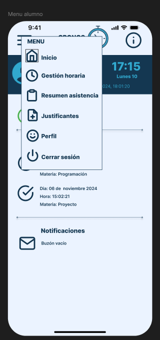
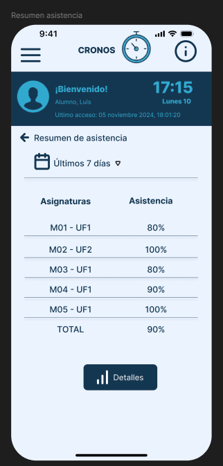
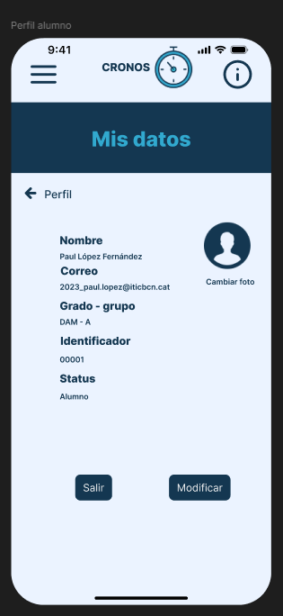
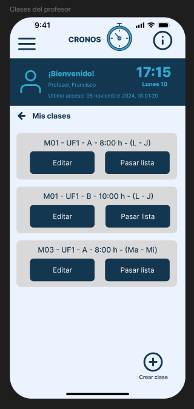
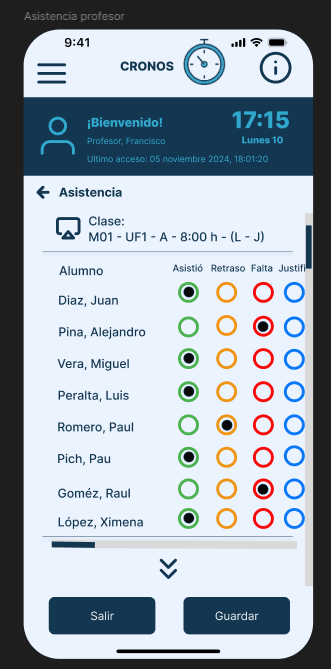
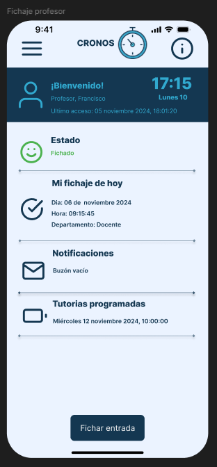
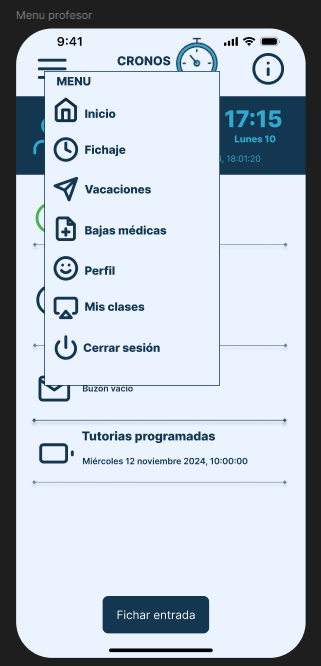
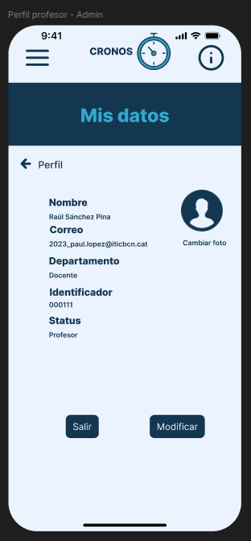

# Control_de_fitxatge

# DAM

1. Pantalla de login para cualquier usuario.

2. Pantalla de inicio o gestión horario del alumno donde vera el resumen del estado de su asistencia en el dia y notificaciones del centro.

3. Menu del alumno con acceso a otras pantallas.

4. Resumen de asistencia en la cual el alumno vera su asistencia por curso y de forma detallada.

5. Pantalla de acceso al perfil del alumno, tendra la opción de modificar sus datos y su foto de perfil.

6. Pantalla de Clases del profesor, en la cual vera las clases asignadas a el y podrá agregar la clases que necesite o modificarlas.

7. Pantalla de asistencia donde el profesor podrá pasar lista de asistencia por clase.

8. Resumen de asistencia en la cual el profesor vera sus fichajes, notificaciones y tutorias asignadas.

9. Menu del profesor.

10. Pantalla de perfil del profesor.

