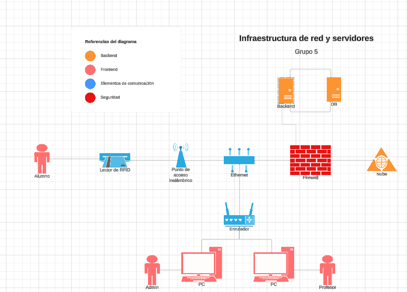
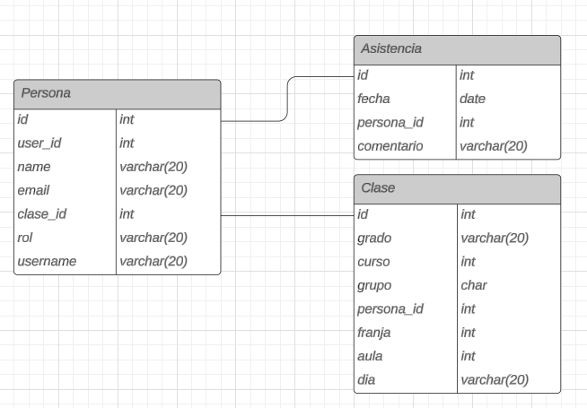

# Control_de_fitxatge

# Sprint 2

# Diseño de la infraestructura de red y servidores

# Diseño de la base de datos de control de presencia

# Crear wireframe d’alta qualitat (figma) i guia d’estils.

Enlace de figma: https://www.figma.com/design/z2xwuK0Cu5d3nB7SrB8HA7/Control-Fitxatge-Wireframe-AF?node-id=0-1&t=gQTxXa1tPH5xBXbD-1