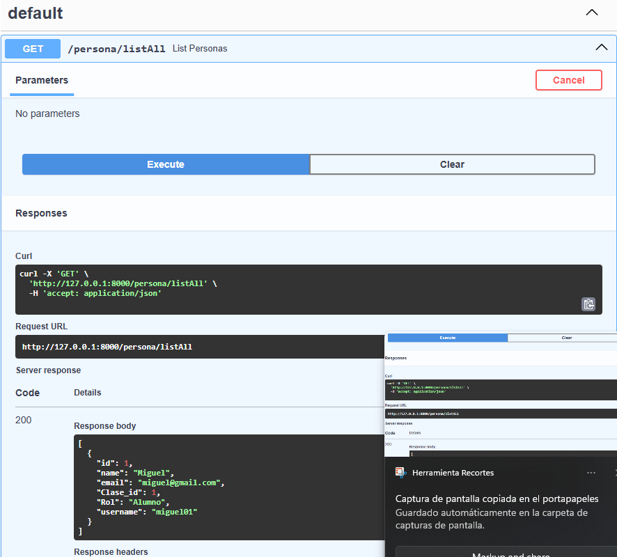
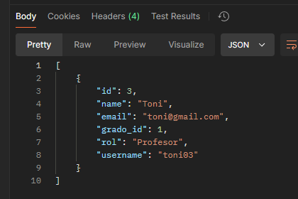
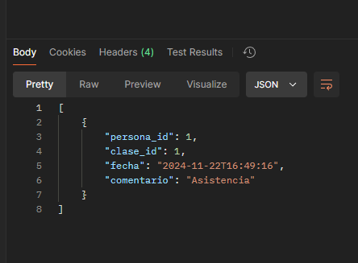

# Control_de_fitxatge

# Consulta lista de personas

Mediante una consulta basica, podemos obtener la lista total de personas (alumnos, profesores) que manejamos en nuestra base de datos.
````
SELECT * FROM persona
````



````
SELECT * FROM persona where rol = "profesor";
````


# Consulta Asistencia

